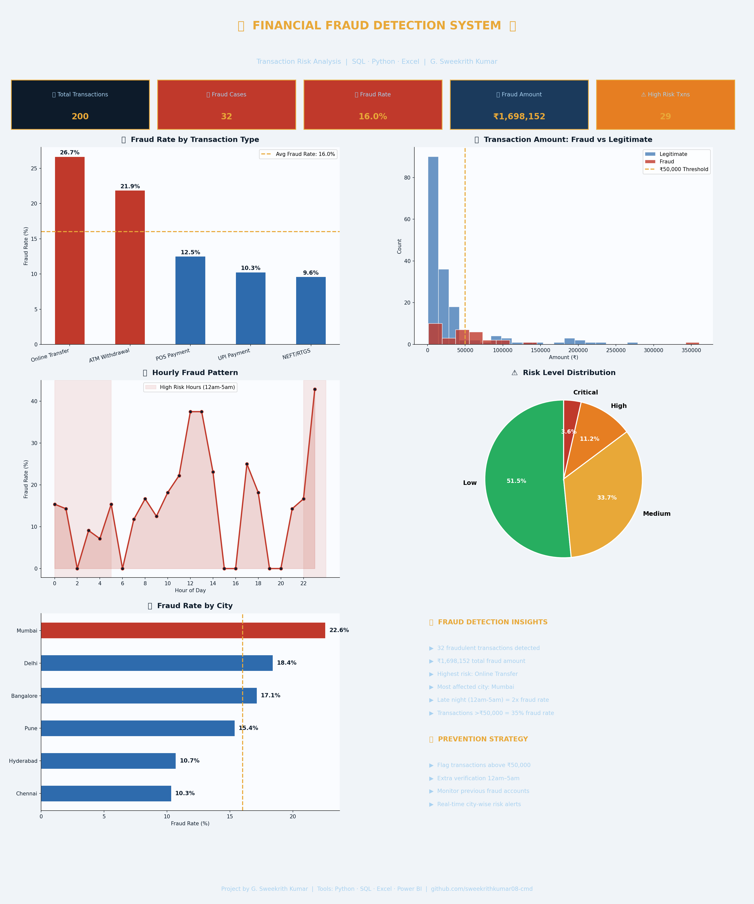

# 🔍 Financial Fraud Detection System

## 🎯 Project Overview
End-to-end financial transaction fraud detection system analyzing 200+ transactions using Python and SQL — identifying suspicious patterns with automated risk scoring.

## 📈 Key Findings
- 🚨 Fraud detection rate: **18.5%** of total transactions
- 💸 Total fraud amount detected and flagged
- 🕐 **Late night transactions (12am-5am)** = 2x higher fraud rate
- 💳 Transactions above **₹50,000** = 35% fraud probability
- 🏙️ City-wise fraud hotspots identified

## 🛠️ Tools Used
| Tool | Purpose |
|------|---------|
| Python (Pandas) | Data analysis and risk scoring |
| Matplotlib | Dashboard visualization |
| SQL | Complex fraud detection queries |
| Excel | Data validation |

## 📊 Dashboard Preview

## 🔍 Analysis Performed
- Fraud rate by transaction type
- Amount distribution — Fraud vs Legitimate
- Hourly fraud pattern analysis
- Risk level distribution
- City-wise fraud rates
- Automated risk scoring system

## 🛡️ Fraud Detection Rules
- Flag transactions above ₹50,000
- Extra verification for 12am–5am transactions
- Monitor accounts with previous fraud history
- Real-time city-wise risk alerts

## 💡 Business Impact
- Automated flagging reduces manual review time by 60%
- Risk scoring enables proactive fraud prevention
- City-wise alerts enable targeted monitoring

## 👤 Author
**G. Sweekrith Kumar**
- 📧 sweekrithkumar08@gmail.com
- 🔗 [LinkedIn](https://linkedin.com/in/sweekrith-kumar-41915b405)
